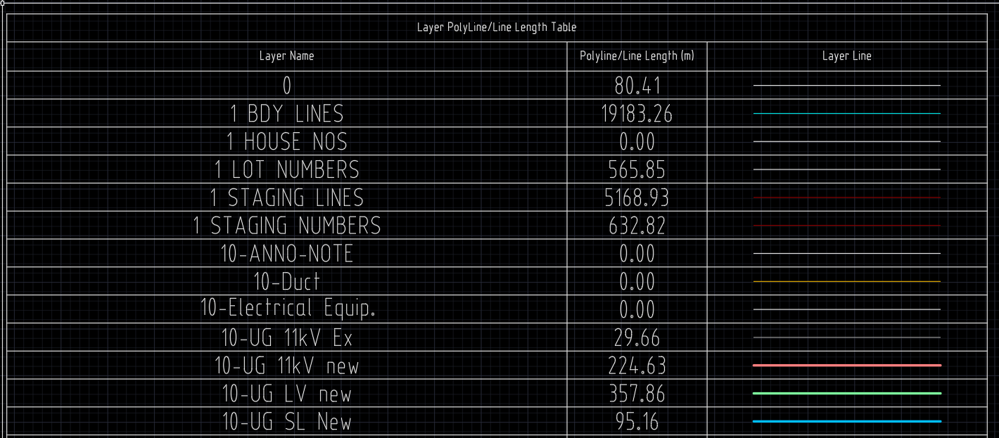
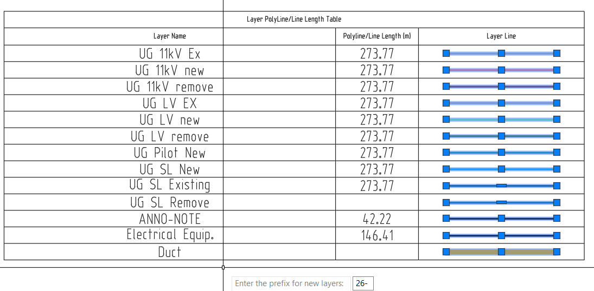
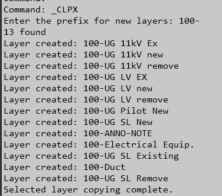
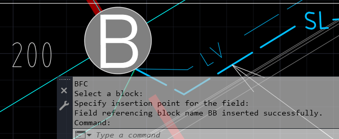

# Lisps Original

Created with the help of ChatGPT with tweaks when it didn't work quite right.

| Name                       | Command |
|----------------------------|---------|
| PolyLine Table             | PLT     |
| Copy Layer with Prefix     | CLPX    |
| Copy Layer with Suffix     | CLSX    |
| Total Polyline Length Text | LTX     |
| Block Field Count          | BFC     |

## PolyLine Table - PLT

Inserts list of layers that have polylines and their lengths.

## Copy Layer with Prefix - CLPX

Copies selected layer/s with prompt for prefix.

## Copy Layer with Suffix - CLSX

Copies selected layer/s with prompt for suffix.  As above.

## Total Polyline Length Text - LTX

Select polylines to measure and the total length will be displayed in a text object.
The dwgunits is selected and added to the suffix.
This wil be printed in the command line, but the text defaults to meters.

## Block Field Count - BFC

Create a field with total count of selected block.
Use REA to update the field.

# Lisps used in custom toolbar

| Name                        | Command  | Source                                                            |
|-----------------------------|----------|-------------------------------------------------------------------|
| Rotate Multiple Objects     | RMO      | https://www.cadforum.cz/en/download.asp?fileID=3577               |
| Text 2 Mtext                | T2M      | https://www.lee-mac.com/text2mtext.html                           |
| Incremental Numbering Suite | NUMINC   | https://www.lee-mac.com/numinc.html                               |
| EP_WIRE_V14-1.VLX           | EP_WIRE  | https://sreekanthkadungil.blogspot.com/2024/03/photo-gallery.html |
| Total Length                | TL       | https://payazed.wordpress.com/2015/06/02/tl/                      |
| PLDiet                      | PLD      | https://www.cadforum.cz/en/download.asp?fileID=3078               |
| Block Counter               | BLKCOUNT | https://www.lee-mac.com/blockcounter.html                         |
| Join Line                   | JL       | https://payazed.wordpress.com/2015/06/02/jl/                      |
| Block Legend                | BLEGEND  | https://www.cadforum.cz/en/download.asp?fileID=928                |

# Lisps

| Name              | Website                                                                                  |
|-------------------|------------------------------------------------------------------------------------------|
| Kims Projects     | https://www.kimprojects.com/free-lisp-programs/                                          |
| CADViet Forum     | https://www.cadviet.com/forum/index.php?app=forums&module=forums&controller=forums&id=50 |
| Jeffery P Sanders | https://jefferypsanders.com/autolisp.html                                                |
| AfraLisp          | https://www.afralisp.net/autolisp/                                                       |
| Lee Mac           | https://www.lee-mac.com/programs.html                                                    |