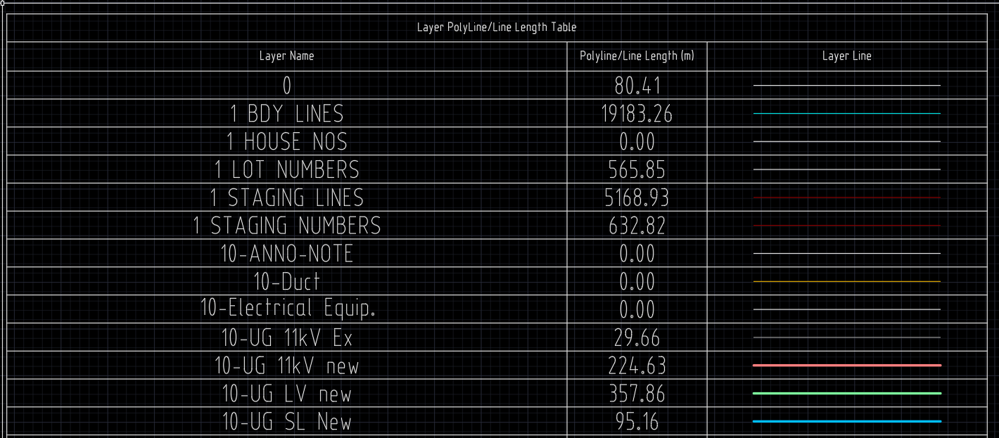

Lisps created with the help of ChatGPT with tweaks when it didn't work quite right.

## PolyLine Table - PLT

Inserts list of layers that have polylines and their lengths.

## Copy Layer with Prefix - CLPX

Copies selected layer/s with prompt for prefix

## Copy Layer with Suffix - CLSX

Copies selected layer/s with prompt for suffix

## Total Polyline Length Text - LTX