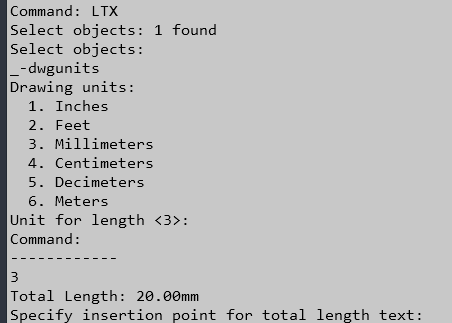

# Lisps created with the help of ChatGPT with tweaks when it didn't work quite right.

## PolyLine Table - PLT

Inserts list of layers that have polylines and their lengths.

## Copy Layer with Prefix - CLPX

Copies selected layer/s with prompt for prefix.

## Copy Layer with Suffix - CLSX

Copies selected layer/s with prompt for suffix.  As above.

## Total Polyline Length Text - LTX

Select polylines to measure and the total length will be displayed in a text object.
The dwgunits is selected and added to the suffix.
This wil be printed in the command line, but the text defaults to meters.

## Block Field Count - BFC

Create a field with total count of selected block.
Use REA to update the field.

# Lisps used in custom toolbar

| Name                    | Command | Source                                              |   |   |
|-------------------------|---------|-----------------------------------------------------|---|---|
| Rotate Multiple Objects | RMO     | https://www.cadforum.cz/en/download.asp?fileID=3577 |   |   |
|                         |         |                                                     |   |   |
|                         |         |                                                     |   |   |